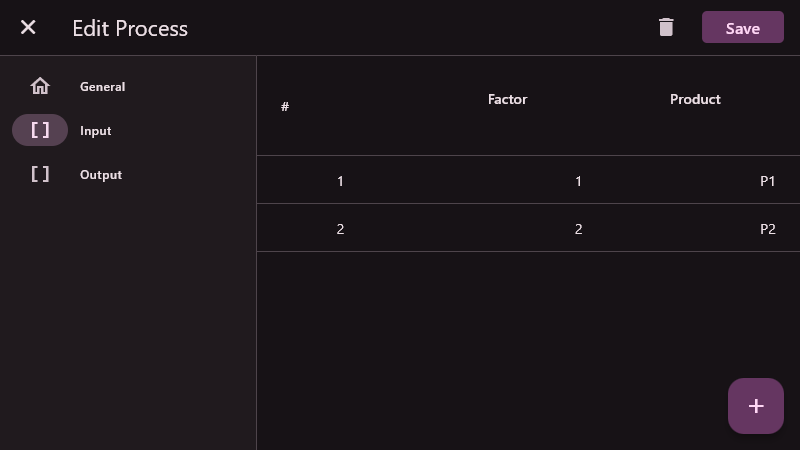
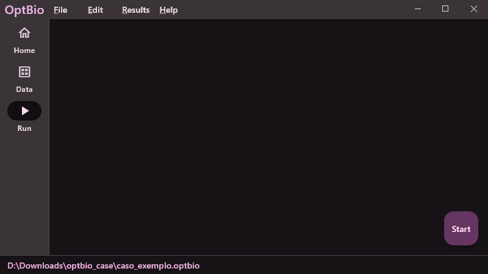

<style>
img[alt~="center"] {
  display: block;
  margin: 0 auto;
}
</style>

<!-- _class: lead -->
# PSR Hub

<!--
- Warm welcome and introduction.
- Briefly outline the objectives and what attendees will learn about psrhub.
-->

---

<!-- _class: lead -->
# Overview

---

## TODO

- deployment
- seamless integration with Julia Applications (via PSRContinuousDeployment.jl)
- migrations
- unidades ao lado do formulário
- pop-up da tela de elemento
- tela de coleções com resumo dos elementos
- vetores na tela de elementos
- internacionalização e localização
- cards customizáveis
- enumerados reutilizáveis
- tooltips
- pode navegar pela interface enquanto o modelo executa
- fazer gifs ao invez de imagens
- drag and drop casos
- light and dark mode
- exportar e importar dados para csv
- Custom window frame - remove standard Windows/macOS/Linux titlebar and buttons
- arquivo unico
- extensão do programa
- poder ver o log de execução depois de rodar


---

## Team

---

## What is PSR Hub?

- Define psrhub and its mission.
- Discuss the motivation behind developing PSRHub.
- The inspiration behind creating psrhub.
- Briefly introduce PSRHub and its primary purpose.
- Highlight the need for an easy-to-integrate interface for optimization models.
- Highlight the development team's expertise and their objectives.
- interface responsiva e moderna
- facil de integrar com os modelos e projetos da psr
- facil desenvolvimento e manutenção
- facil de usar

---

# Download and Installation

<!-- qr code and links -->

---

<!-- _class: lead -->
# Walkthrough

---

## Walkthrough: Startup

---

## Walkthrough: Home

- Card's Summary


---

## Walkthrough: Data


---

## Walkthrough: Element


---

## Walkthrough: Element with Vectors (1)


---

## Walkthrough: Element with Vectors (2)



---

## Walkthrough: Element with Vectors (3)


---

## Walkthrough: Run (1)



---

## Walkthrough: Run (2)


---

## Walkthrough: Settings


---

<!-- _class: lead -->
# Deep Dive into Details

---

## Database

---

## Migrations

---

## Interface

---

## Folder Structure

```
database
├── migrations
│   ├── 1
│   │   ├── down.sql
│   │   └── up.sql
│   ├── 2
│   │   ├── down.sql
│   │   └── up.sql  
│   └── ...
└── ui
    ├── themes
    │   ├── dark.toml
    │   └── light.toml
    ├── main.toml
    ├── themal_plants.toml
    └── ...
```

---

## Key Features and Benefits

- Highlight psrhub's unique features: Generic views generation, easy model integration, and color scheme seeding.
- Discuss the benefits of these features in streamlining development workflows.

---

<!-- _class: lead -->
# Deep Dive into Features

---

## Generic Views Generation

Explain the concept and how it simplifies UI development.
Demonstrate a simple example of generic views in action.

---

## Ease of Integration with Models

Detail the process of integrating models with psrhub.
Showcase the currently integrated models: GNoMo, HyCo, OptBio.

---

## Cross-Platform Capability

Discuss the importance of cross-platform support in today's development landscape.
Demonstrate how psrhub achieves cross-platform functionality across Windows, Mac, and Linux.

---

## Flutter Framework

Why Flutter was chosen for psrhub.
Advantages of using Flutter for both frontend and backend development.

---

## SQLite Database

The role of SQLite in psrhub.
Benefits of using SQLite for local data storage solutions.

```sql
thermal = Thermal();
thermal_generation = thermal:load("gerter");

thermal_generation
  :aggregate_agents(BY_SUM(), Collection.FUEL)
  :save("thermal_generation_per_fuel");
```

---

## Given a color, give me a color scheme

- Create static and dynamic color schemes from a single color or a core palette.

---

## Color Scheme Seeding

Explain what color scheme seeding is and its significance.
Show how color schemes can be easily implemented and customized in psrhub.

---

## MVVM Architecture

Introduction to the MVVM architecture within psrhub.
Discuss its benefits for easy development and maintenance.

---

## Decentralized Development

Highlight the decentralized nature of psrhub's development process.
Mention the collaborative efforts of the current developer team.

## Background and Development

- Mention the choice of Flutter for cross-platform compatibility (Windows, Mac, and Linux).

---

<!-- _class: lead -->
# Hands-on and Walkthrough

---

## Key Features of PSRHub

Generic Interface: Explain how PSRHub provides a generic interface that can easily adapt to various optimization models.
Cross-Platform Compatibility: Elaborate on how being built with Flutter allows PSRHub to work seamlessly on Windows, Mac, and Linux.
User Experience: Describe the interface's design principles focusing on simplicity and ease of use.

---

## Technical Specifications
Flutter Framework: Briefly introduce Flutter and its benefits for cross-platform development.
SQLite Database Integration: Discuss the advantages of using SQLite, emphasizing portability, reliability, and ease of integration.
Architecture Overview: Provide a high-level overview of PSRHub's architecture, including the model-view-controller (MVC) pattern, if applicable.

---

## Benefits of Using PSRHub
Ease of Integration: Detail how PSRHub simplifies the process of integrating with existing optimization models.
Efficiency and Productivity: Highlight how a generic interface can reduce development time and increase productivity.
Scalability: Explain how PSRHub is designed to scale with projects of varying sizes and complexities.
Database Advantages: Further discuss the benefits of SQLite within PSRHub, such as lightweight implementation and offline data accessibility.

---

## Case Studies/Success Stories
Share real-world examples or hypothetical case studies where PSRHub has been or could be successfully implemented.
Highlight feedback from developers or users, if available.

---

## Future Roadmap
Outline upcoming features or enhancements planned for PSRHub.
Discuss any planned expansions or integrations.

---

## Conclusion and Call to Action
Summarize the key points made throughout the presentation.
Encourage the audience to try PSRHub for their optimization model needs.

---

## Q&A Session
Open the floor for any questions from the audience, encouraging discussions on technical aspects, implementation strategies, or any other inquiries.

---